## SAE501 - Visa 3 - Compte Rendu: PHP & MariaDB & API Python

- Rieux Kylian

---

## [cite_start]Visa 3 : PHP & MariaDB [cite: 70]

[cite_start]L'objectif de cette version (Version 3) était de transformer l'accés à la bdd via une API avec Fastapi et une gestion d'authentification soimple sans jetons.

### 1. API avec Fastapi

On créer un fichier python main.py et un fichier requirements.txt(pour les extensions utile a l'API).

#### 1.1 Main.py :


En s'inspirant de l'API créer en 2e année, on obtient cette API:

```python
from fastapi import FastAPI, HTTPException
from pydantic import BaseModel
from typing import List
import mysql.connector

app = FastAPI()

# Modèle de données pour les requêtes POST et PUT
class Etudiant(BaseModel):
    nom: str
    no_groupe: int

# Connexion globale (Pensez à utiliser la boucle Try/Except si Docker est lent)
mydb = mysql.connector.connect(
    user='api_user',
    password='api_password',
    host='db',
    port=3306,
    database='ma_bdd',
    autocommit=True
)

# --- LES ROUTES SONT MAINTENANT LIBRES D'ACCÈS ---

@app.get("/etudiants")
def get_etudiants():
    cursor = mydb.cursor(dictionary=True, buffered=True)
    try:
        cursor.execute("SELECT * FROM Etudiants")
        return cursor.fetchall()
    finally:
        cursor.close()

@app.get("/groupes")
def get_groupes():
    cursor = mydb.cursor(dictionary=True, buffered=True)
    try:
        cursor.execute("SELECT NoGroupe, NomGroupe FROM Groupes")
        return cursor.fetchall()
    finally:
        cursor.close()

@app.post("/etudiants")
async def create_etudiant(etudiant: Etudiant):
    cursor = mydb.cursor(buffered=True)
    try:
        sql = "INSERT INTO Etudiants (Nom, NoGroupe) VALUES (%s, %s)"
        cursor.execute(sql, (etudiant.nom, etudiant.no_groupe))
        return {"message": "Étudiant ajouté"}
    except Exception as e:
        raise HTTPException(status_code=500, detail=str(e))
    finally:
        cursor.close()

@app.put("/etudiants/{nom_etu}")
async def update_etudiant(nom_etu: str, etudiant: Etudiant):
    cursor = mydb.cursor(buffered=True)
    try:
        sql = "UPDATE Etudiants SET Nom = %s, NoGroupe = %s WHERE Nom = %s"
        cursor.execute(sql, (etudiant.nom, etudiant.no_groupe, nom_etu))
        return {"message": "Étudiant mis à jour"}
    finally:
        cursor.close()

@app.delete("/etudiants/{nom_etu}")
async def delete_etudiant(nom_etu: str):
    cursor = mydb.cursor(buffered=True)
    try:
        sql = "DELETE FROM Etudiants WHERE Nom = %s"
        cursor.execute(sql, (nom_etu,))
        return {"message": "Étudiant supprimé"}
    finally:
        cursor.close()

@app.get("/etudiants/groupe/{grp}")
def get_etu_by_grp(grp: int):
    cursor = mydb.cursor(dictionary=True, buffered=True)
    try:
        cursor.execute("SELECT * FROM Etudiants WHERE NoGroupe = %s", (grp,))
        return cursor.fetchall()
    finally:
        cursor.close()
        
@app.post("/auth")
async def login_simple(form_data: dict):
    cursor = mydb.cursor(dictionary=True, buffered=True)
    try:
        # On cherche l'utilisateur par son email
        sql = "SELECT EMAIL, PASS, STATUT FROM utilisateurs WHERE EMAIL = %s"
        cursor.execute(sql, (form_data['mail'],))
        user = cursor.fetchone()
        
        # Vérification du mot de passe
        if user and user["PASS"] == form_data['pass']:
            return {"success": True, "login": user["EMAIL"], "statut": user["STATUT"]}
        else:
            raise HTTPException(status_code=401, detail="Identifiants incorrects")
    finally:
        cursor.close()
        
@app.get("/etudiants/{nom_etu}")
def get_one_etudiant(nom_etu: str):
    cursor = mydb.cursor(dictionary=True, buffered=True)
    try:
        sql = "SELECT * FROM Etudiants WHERE Nom = %s"
        cursor.execute(sql, (nom_etu,))
        res = cursor.fetchone()
        if not res:
            raise HTTPException(status_code=404, detail="Étudiant non trouvé")
        return res
    finally:
        cursor.close()
```

### 1.2 Requirements.txt :

Pour la bonne utilisation de l'API, on a besoin des packages suivant:

```txt
fastapi
uvicorn
mysql-connector-python
pydantic
requests
python-jose[cryptography]
passlib[bcrypt]
python-multipart
```

### 1.3 Dockerfile_api

```docker
FROM python:3.12

WORKDIR /app

RUN apt update && apt install -y \
    libmariadb-dev gcc \
    && rm -rf /var/lib/apt/lists/*

COPY requirements.txt .
RUN pip install --no-cache-dir -r requirements.txt

COPY . .

CMD ["uvicorn", "main:app", "--host", "0.0.0.0", "--port", "8000"]
```

### 1.4 docker-compose.yml

Pour le bon lancement des containers, on utilise un docker-compose.

```yaml
version: "3.9"
services:
  db:
    image: mariadb:11
    container_name: db
    restart: always
    environment:
      - MARIADB_ROOT_PASSWORD=root_password
      - MARIADB_DATABASE=ma_bdd
      - MARIADB_USER=api_user
      - MARIADB_PASSWORD=api_password
    ports:
      - "3306:3306"
    networks:
      - network_
    volumes:
      - db_data:/var/lib/mysql
      # Montage fichier par fichier pour forcer la visibilité
      - ./bdd/bdd_folder/utilisateurs.sql:/docker-entrypoint-initdb.d/01_utilisateurs.sql
      - ./bdd/bdd_folder/etudiants_grp.sql:/docker-entrypoint-initdb.d/02_etudiants.sql
  api:
    build:
      context: ./api
      dockerfile: Dockerfile_api
    container_name: fastapi_api
    restart: on-failure
    depends_on:
      - db
    networks:
      - network_
    ports:
      - "8000:8000"
    environment:
      - DB_HOST=db
      - DB_NAME=ma_bdd
      - DB_USER=api_user
      - DB_PASSWORD=api_password

  web:
    build:
      context: ./web
      dockerfile: Dockerfile
    container_name: web_site
    restart: always
    volumes:
      - ./web/projet:/var/www/html
    depends_on:
      - api
    networks:
      - network_
    ports:
      - "8080:80"

networks:
  network_:
    driver: bridge
volumes:
  db_data:
```

### 2. Corrections et Adaptations
### 2.1 Adaptation des Fonctions qui utilise la bdd

On doit modifier toutes les fonctions qui faisaient appelle a la bdd.

```php
<?php


if (session_status() === PHP_SESSION_NONE) {
    session_start();
}

if (!defined('API_BASE_URL')) {
    define('API_BASE_URL', 'http://api:8000');
}

// --- FONCTION DE COMMUNICATION SIMPLIFIÉE (SANS JWT) ---
if (!function_exists('callAPI')) {
function callAPI($method, $endpoint, $data = false) {
    $url = API_BASE_URL . $endpoint;
    
    // On ne garde que le Content-type JSON
    $headers = "Content-type: application/json\r\n";

    $options = [
        'http' => [
            'header'  => $headers,
            'method'  => $method,
            'content' => $data ? json_encode($data) : null,
            'ignore_errors' => true
        ]
    ];
    
    $context  = stream_context_create($options);
    $result = @file_get_contents($url, false, $context);
    return $result ? json_decode($result, true) : false;
}
}

// --- LISTER LES GROUPES ---
if (!function_exists('listerGroupes')) {
function listerGroupes() {
    return callAPI('GET', '/groupes'); 
}
}

// --- LISTER LES ETUDIANTS ---
if (!function_exists('listerEtudiants')) {
function listerEtudiants() {
    return callAPI('GET', '/etudiants');
}
}

if (!function_exists('listerEtudiantsParGroupe')) {
    function listerEtudiantsParGroupe($grp) {
        return callAPI('GET', '/etudiants/groupe/' . urlencode($grp));
    }
}

// --- AJOUTER UN ETUDIANT ---
if (!function_exists('ajouterEtudiant')) {
function ajouterEtudiant($nom, $grp) {
    $donnees = [
        'nom' => $nom,
        'no_groupe' => (int)$grp // Cast en int pour correspondre au Pydantic
    ];

    $reponse = callAPI('POST', '/etudiants', $donnees);

    if ($reponse && !isset($reponse['detail'])) {
        return 1;
    }
    return 0;
}
}

// --- MODIFIER UN ETUDIANT ---
if (!function_exists('modifierEtudiant')) {
function modifierEtudiant($nom_actuel, $nouveau_nom, $nouveau_grp) {
    $donnees = [
        'nom' => $nouveau_nom,
        'no_groupe' => (int)$nouveau_grp
    ];

    $endpoint = "/etudiants/" . urlencode($nom_actuel);
    $reponse = callAPI('PUT', $endpoint, $donnees);

    return ($reponse && !isset($reponse['detail'])) ? 1 : 0;
}
}

// --- SUPPRIMER UN ETUDIANT ---
if (!function_exists('supprimerEtudiant')) {
function supprimerEtudiant($nom) {
    $endpoint = "/etudiants/" . urlencode($nom);
    $reponse = callAPI('DELETE', $endpoint);

    return ($reponse && !isset($reponse['detail'])) ? 1 : 0;
}
}

// --- UTILITAIRES D'AFFICHAGE ---
if (!function_exists('redirect')) {
function redirect($url, $tps) {
    $temps = $tps * 1000;
    echo "<script type=\"text/javascript\">
        function redirect() { window.location='$url'; }
        setTimeout('redirect()', $temps);
    </script>";
}
}

if (!function_exists('afficheTableau')) {
function afficheTableau($tab) {
    if (empty($tab) || !is_array($tab)) {
        echo "<p style='color:orange;'>Aucune donnée disponible.</p>";
        return;
    }

    if (isset($tab['detail'])) {
        echo "<p style='color:red;'>Erreur : " . htmlspecialchars($tab['detail']) . "</p>";
        return;
    }

    echo '<table class="table table-striped table-bordered">';
    if (isset($tab[0]) && is_array($tab[0])) {
        echo '<thead><tr>';
        foreach($tab[0] as $colonne => $valeur) {
            echo "<th>" . htmlspecialchars($colonne) . "</th>";
        }
        echo '</tr></thead><tbody>';

        foreach($tab as $ligne) {
            echo '<tr>';
            foreach($ligne as $cellule) {
                echo "<td>" . htmlspecialchars($cellule) . "</td>";
            }
            echo '</tr>';
        }
        echo '</tbody>';
    }
    echo '</table>';
}
}
function authentification($mail, $pass) {
    $donnees = ['mail' => $mail, 'pass' => $pass];
    $reponse = callAPI('POST', '/auth', $donnees);

    if ($reponse && isset($reponse['success']) && $reponse['success'] === true) {
        $_SESSION['login'] = $reponse['login'];
        $_SESSION['admin'] = ($reponse['statut'] === 'admin');
        return true;
    }
    return false;
}
```

### 2.2 reglage de certains problème spécifique

Les pages du site web utilise bootstrap en local or pour diminuer la taille des fichiers a déplacé j'ai retiré cette fonction. Les pages utilise désormais les fichiers bootstrap en ligne.

Par exemple Index.php

```php
<?php
if (session_status() === PHP_SESSION_NONE) {
    session_start();
}

include_once 'fonctions.php';
include_once 'formulaires.php';

if (isset($_GET["action"]) && $_GET["action"] == 'logout') {
    session_destroy();
    $_SESSION = array();
    header("Location: index.php");
    exit();
}
?>
<!DOCTYPE html>
<html lang="fr">
<head>
    <meta charset="utf-8">
    <title>Sae24</title>
    <link rel="stylesheet" href="style.css" type="text/css" />
    <link href="https://cdn.jsdelivr.net/npm/bootstrap@5.1.3/dist/css/bootstrap.min.css" rel="stylesheet" integrity="sha384-1BmE4kWBq78iYhFldvKuhfTAU6auU8tT94WrHftjDbrCEXSU1oBoqyl2QvZ6jIW3" crossorigin="anonymous">
    <script src="Ajax.js"></script>
</head>
<body>
    <header>
        <h1>Sae24</h1>
    </header>

    <nav class="d-flex">
        <?php
        if (empty($_SESSION['login'])) {
            FormulaireAuthentification();
        } else {
            Menu(); 
        }
        ?>
    </nav>

    <article>
        <?php
        // Affichage du message d'accueil
        if (!empty($_SESSION['login'])) {
            echo '<h2>Bienvenue ' . htmlspecialchars($_SESSION['login']) . ' sur la page d accueil.</h2>';	
            
            // Zone centrale : Affichage des données uniquement si connecté
            echo "<nav class='d-flex'>";
                
                // Colonne de gauche : Liste globale
                echo "<div class='col-6' id='nav'>";
                    echo '<h2>Liste des etudiants</h2>';
                    $eleve = listerEtudiants();
                    afficheTableau($eleve);
                echo "</div>";

                // Colonne de droite : Filtrage Ajax / Groupe
                echo "<div class='col-6'>";
                    echo '<h2>Liste des etudiants Ajax</h2>';
                    formchgrp();
                    
                    if (isset($_GET['grp'])) {
                        $etudiants = listerEtudiantsParGroupe($_GET['grp']);
                        afficheTableau($etudiants);
                    }
                    
                    // Zone cible pour le JavaScript (Ajax.js)
                    echo "<div id='taba'></div>";
                echo "</div>";

            echo "</nav>";
        } else {
            echo '<p>Vous êtes déconnectés</p>';	
            redirect("connexion.php", 0);
        }
        ?>
    </article>

    <footer>
        <p>Pied de la page <?php echo htmlspecialchars($_SERVER['PHP_SELF']); ?></p>
        <a href="javascript:history.back()">Retour à la page précédente</a>
    </footer>
</body>
</html>
```

### 3. Containerisation Docker (Multi-conteneurs)
Le déploiement respecte l'exigence d'utiliser un Dockerfile pour PHP et un autre pour MariaDB.


### 4. Fonctionnalités a tester
Les fonctions de l'application ont été testées et validées sur l'architecture multi-conteneur MariaDB/PHP/API.

1. Test d'Architecture et Connectivité

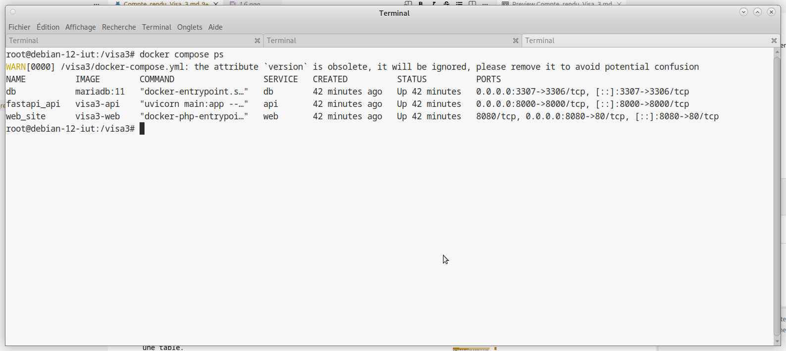

Sur ce screen, après la commande "docker compose ps" on observe bien les 3 conainer.

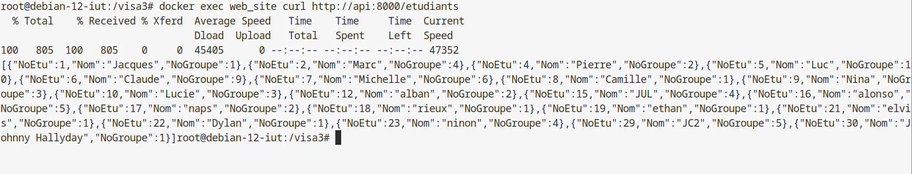

Après la commande "docker exec web_site curl http://api:8000/etudiants", il y a bien un retour de la part de l'api vers le conteneur hebergeant le site web, donc les données sont bien transmise.

2. Test d'Authentification Simple

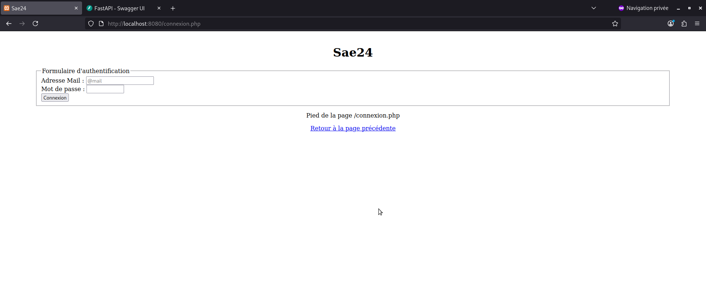

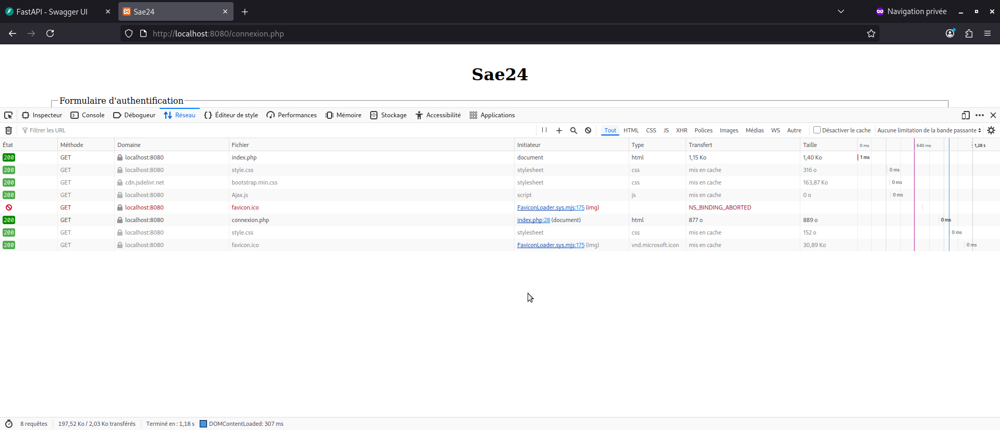

Après essayer d'accéder directement a index.php on obtient l'affichage du screen 2.1, cela est confirmé avec le screen ci dessus ou l'on constate bien la redirection faite par le code php.


Afin de verifier l'authentification, on teste également un mauvais mdp, cela nous renvoie bien un message d'erreur


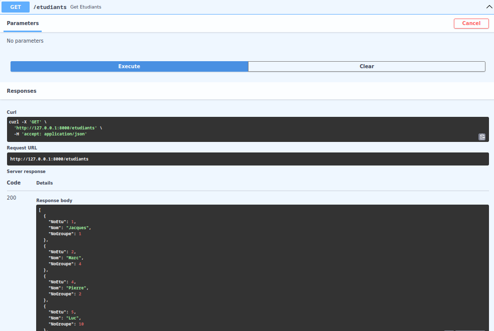

Après l'utilisation de la bonne combinaison login mdp, on arrive bien sur la page index


3. Test des Opérations CRUD


test de lecture de la bdd via l'interface web de l'api


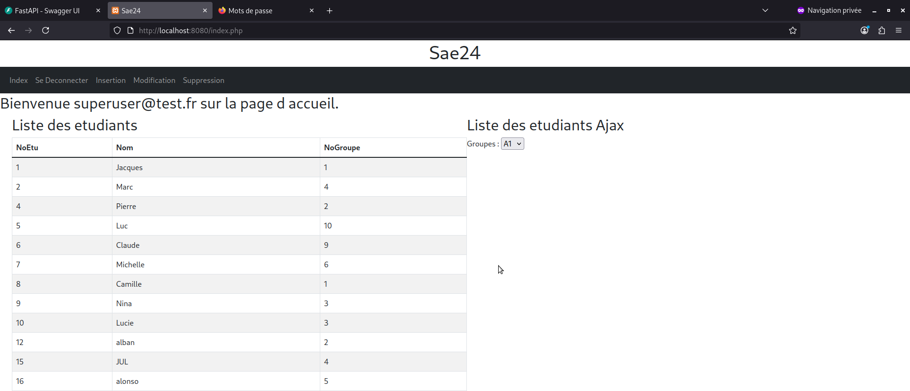

test de lecture de la bdd dircetement depuis le dite web, lorqu'on charge la page index et que l'affichage des etudiants fonctionne la lecture de la bdd.

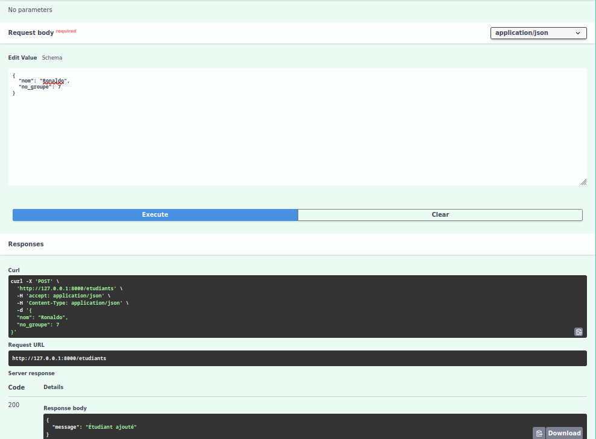

test d'ajout d'un etudiant a la bdd via l'interface web de l'api

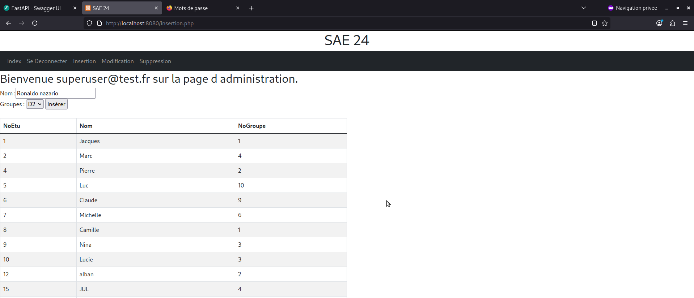

test d'ajout d'un etudiant a la bdd via le site web


Avec ce screen on constate que les deux etudiants rajoutés via l'interface web et le site même a bel et bien fonctionner


test de suppresion d'un etudiants dans la bdd depuis l'interface web de l'api

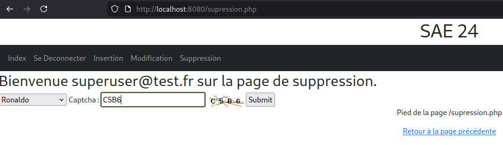

test de suppression d'un etudiants dans la bdd depuis le site web même


On constate bien qu'en allant sur la page index les etudiants rajouter précédement ont été supprimés.

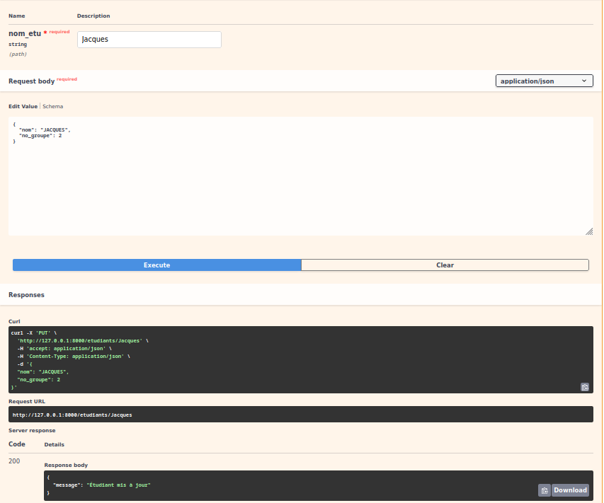

test de modifictaion d'un etudiants de la bdd depuis l'interface web de l'api

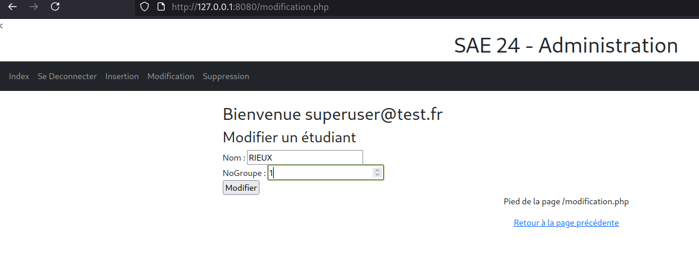

test de modification d'un etudiants de la bdd depuis le site web même

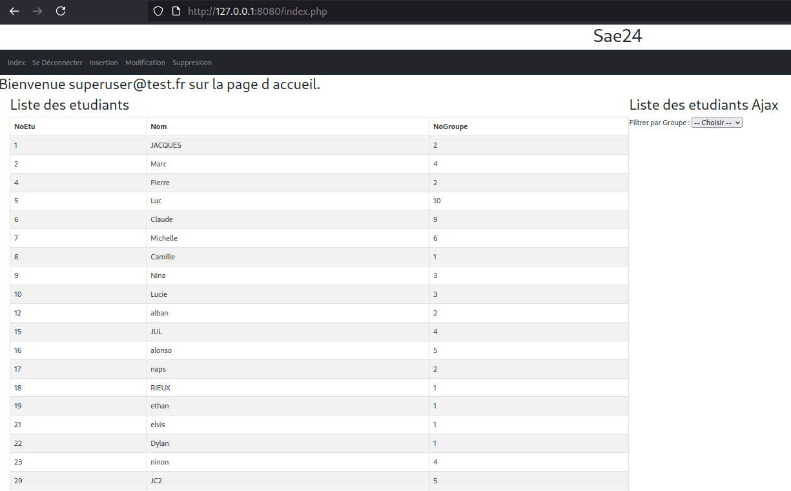

On constate bien le changements sur les deux étudiants.

4. Test d'Intégration et Logs
   
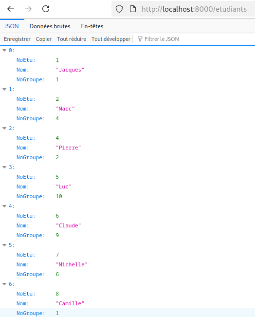

Avec ce screen on constate bien que l'on peut accéder a l'api car le résultat est du JSON brut donc l'api est indépendante du php.

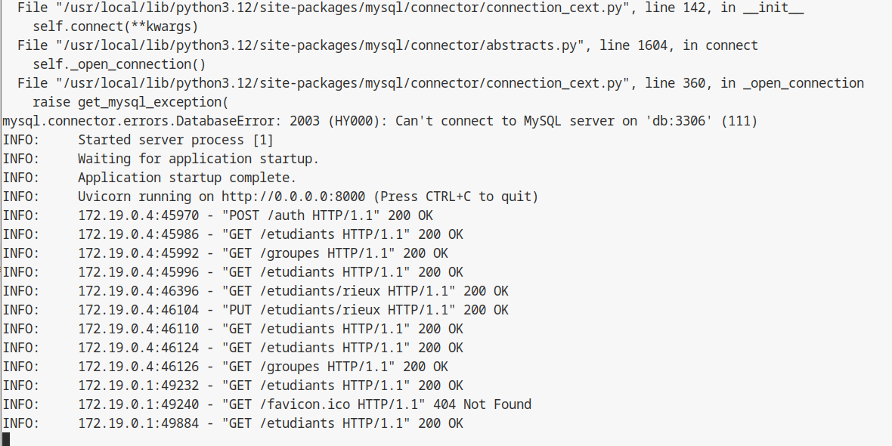

Sur ce screen, on constate les logs de l'api et donc le retour des interrogation faite par le php. On constate bien des retours en 200 OK ce qui prouve le bon fonctionnement de l'api.


### Notice d'Installation
Prérequis
Docker Engine 20.10+

```bash
#se situer dans le dossier et lancer la commande suivante
docker compose up --build
```

## Conclusion
### Objectifs du VISA 3 Atteints
Création du API qui permet d'éxécuter les opérations curl sur au moins une table.

Création d'un API pour l'athentification simple.

Modifier le programme PHP pour utiliser l'API.

GitLab : Utilisation pour piloter le dépôt des codes sources.

Utilisation de docker compose pour lancer toute l'application.

### Préparation VISA 4
Le travail suivant (Version 4) consistera à utiliser des jwt token pour l'authentification