## SAE501 - Visa 4 - Compte Rendu: PHP & MariaDB & API Python

- Rieux Kylian

---

lien vers github: https://github.com/kylianrieux1/Sae-5.01.git

## [cite_start]Visa 4 : PHP & MariaDB [cite: 70]

[cite_start]L'objectif de cette version (Version 4) était d'utiliser des jetons JWT via l'api pour l'athentification.

### 1. Modification de l'API

On modifie le fichier créer lors de la précédente validation afin d'utiliser les jwt.

#### 1.1 Main.py :


```python
from fastapi import FastAPI, HTTPException, Depends
from fastapi.security import OAuth2PasswordBearer, OAuth2PasswordRequestForm
from pydantic import BaseModel
from typing import List, Optional
from datetime import datetime, timedelta
from jose import JWTError, jwt
import mysql.connector

SECRET_KEY = "api_pass"
ALGORITHM = "HS256"
ACCESS_TOKEN_EXPIRE_MINUTES = 30

app = FastAPI()
oauth2_scheme = OAuth2PasswordBearer(tokenUrl="token")

class Etudiant(BaseModel):
    nom: str
    no_groupe: int

class Token(BaseModel):
    access_token: str
    token_type: str
    statut: str

# Connexion globale
mydb = mysql.connector.connect(
    user='api_user',
    password='api_password',
    host='db',
    port=3306,
    database='ma_bdd',
    autocommit=True # Permet d'envoyer les modifs immédiatement
)

def create_access_token(data: dict, expires_delta: Optional[timedelta] = None):
    to_encode = data.copy()
    if expires_delta:
        expire = datetime.utcnow() + expires_delta
    else:
        # Utilise la constante définie au début du fichier (30 min)
        expire = datetime.utcnow() + timedelta(minutes=ACCESS_TOKEN_EXPIRE_MINUTES)
    
    to_encode.update({"exp": expire})
    return jwt.encode(to_encode, SECRET_KEY, algorithm=ALGORITHM)

@app.post("/token", response_model=Token)
async def login(form_data: OAuth2PasswordRequestForm = Depends()):
    cursor = mydb.cursor(dictionary=True, buffered=True)
    try:
        # On récupère l'utilisateur
        sql = "SELECT EMAIL, PASS, STATUT FROM utilisateurs WHERE EMAIL = %s"
        cursor.execute(sql, (form_data.username,))
        user = cursor.fetchone()
        
        # Validation stricte (Point 1)
        if not user or user["PASS"] != form_data.password:
            raise HTTPException(
                status_code=401, # 401 est plus approprié que 400 pour une erreur d'auth
                detail="Identifiant ou mot de passe incorrect",
                headers={"WWW-Authenticate": "Bearer"},
            )

        # Génération du jeton avec EMAIL et STATUT (Point 1)
        access_token_expires = timedelta(minutes=ACCESS_TOKEN_EXPIRE_MINUTES)
        access_token = create_access_token(
            data={"sub": user["EMAIL"], "statut": user["STATUT"]},
            expires_delta=access_token_expires
        )

        return {
            "access_token": access_token, 
            "token_type": "bearer", 
            "statut": str(user["STATUT"]) # Conversion en string pour éviter les surprises
        }
    finally:
        cursor.close()

async def get_current_user(token: str = Depends(oauth2_scheme)):
    try:
        payload = jwt.decode(token, SECRET_KEY, algorithms=[ALGORITHM])
        username: str = payload.get("sub")
        if username is None:
            raise HTTPException(status_code=401, detail="Jeton invalide")
        return username
    except JWTError:
        raise HTTPException(status_code=401, detail="Jeton expiré ou invalide")


@app.get("/etudiants")
def get_etudiant(current_user: str = Depends(get_current_user)):
    cursor = mydb.cursor(dictionary=True, buffered=True)
    try:
        cursor.execute("SELECT * FROM Etudiants")
        res = cursor.fetchall()
        return res # FastAPI convertit automatiquement la liste de dict en JSON
    finally:
        cursor.close()

@app.get("/groupes")
def get_groupes(current_user: str = Depends(get_current_user)):
    cursor = mydb.cursor(dictionary=True, buffered=True)
    try:
        cursor.execute("SELECT NoGroupe, NomGroupe FROM Groupes")
        return cursor.fetchall()
    finally:
        cursor.close()

@app.post("/etudiants")
async def create_etudiant(etudiant: Etudiant, current_user: str = Depends(get_current_user)):
    cursor = mydb.cursor(buffered=True)
    try:
        sql = "INSERT INTO Etudiants (Nom, NoGroupe) VALUES (%s, %s)"
        cursor.execute(sql, (etudiant.nom, etudiant.no_groupe))
        return {"message": "Étudiant ajouté"}
    except Exception as e:
        raise HTTPException(status_code=500, detail=str(e))
    finally:
        cursor.close()

@app.put("/etudiants/{nom_etu}")
async def update_etudiant(nom_etu: str, etudiant: Etudiant, current_user: str = Depends(get_current_user)):
    cursor = mydb.cursor(buffered=True)
    try:
        sql = "UPDATE Etudiants SET Nom = %s, NoGroupe = %s WHERE Nom = %s"
        cursor.execute(sql, (etudiant.nom, etudiant.no_groupe, nom_etu))
        return {"message": "Étudiant mis à jour"}
    finally:
        cursor.close()

@app.delete("/etudiants/{nom_etu}")
async def delete_etudiant(nom_etu: str, current_user: str = Depends(get_current_user)):
    cursor = mydb.cursor(buffered=True)
    try:
        sql = "DELETE FROM Etudiants WHERE Nom = %s"
        cursor.execute(sql, (nom_etu,))
        return {"message": "Étudiant supprimé"}
    finally:
        cursor.close()
        
@app.get("/etudiants/groupe/{grp}")
def get_etu_by_grp(grp: int, current_user: str = Depends(get_current_user)):
    cursor = mydb.cursor(dictionary=True, buffered=True)
    try:
        cursor.execute("SELECT * FROM Etudiants WHERE NoGroupe = %s", (grp,))
        return cursor.fetchall()
    finally:
        cursor.close()
```


### 2. Modification du php
### 2.1 Modification de la page connexion.php et le fichier fonctions.php

On doit modifier la page connexion.php pour utiliser les jwt.

```php
<?php
if (session_status() === PHP_SESSION_NONE) {
    session_start();
}
include_once 'fonctions.php';
include_once 'formulaires.php';

// 1. TRAITEMENT DU FORMULAIRE (Avant tout affichage HTML)
if (!empty($_POST) && isset($_POST["mail"], $_POST["pass"])) {
    if (authentification($_POST["mail"], $_POST["pass"])) {
        header('Location: index.php');
        exit();
    } else {
        $error_message = "Échec d'authentification pour " . htmlspecialchars($_POST["mail"]);
    }
}

// 2. DÉCONNEXION
if (isset($_GET["action"]) && $_GET["action"] == 'logout') {
    session_destroy();
    header('Location: index.php');
    exit();
}
?>
<!DOCTYPE html>
<html lang="fr">
<head>
    <meta charset="utf-8">
    <link rel="stylesheet" href="style.css" type="text/css" />
    <title>Sae24</title>
</head>
<body>
    <header><h1>Sae24</h1></header>
    <nav>
        <?php
        if (empty($_SESSION)) {
            if (isset($error_message)) echo "<p style='color:red'>$error_message</p>";
            FormulaireAuthentification(); 
        } else {
            Menu();
        }
        ?>
    </nav>
		
		<footer>
			<p>Pied de la page <?php echo $_SERVER['PHP_SELF']; ?></p>
			<a href="javascript:history.back()">Retour à la page précédente</a>
		</footer>
	</body>
</html>
```

Ensuite on modifie fonction.php

```php
<?php

#$pdo_db = new PDO(
 #   'mysql:host=db;port=3306;dbname=ma_bdd',
 #   'api_user',
  #  'api_password'
if (session_status() === PHP_SESSION_NONE) {
    session_start();
}
if (!defined('API_BASE_URL')) {
    define('API_BASE_URL', 'http://api:8000');
}

// --- FONCTION DE COMMUNICATION UNIVERSELLE ---
if (!function_exists('callAPI')) {
function callAPI($method, $endpoint, $data = false) {
    $url = API_BASE_URL . $endpoint;
    $headers = "Content-type: application/json\r\n";
    
    if (isset($_SESSION['token'])) {
        $headers .= "Authorization: Bearer " . $_SESSION['token'] . "\r\n";
    }

    $options = [
        'http' => [
            'header'  => $headers,
            'method'  => $method,
            'content' => $data ? json_encode($data) : null,
            'ignore_errors' => true // Permet de voir les erreurs 401/404
        ]
    ];
    
    $context  = stream_context_create($options);
    $result = @file_get_contents($url, false, $context);
    
    // Analyse des headers pour détecter une expiration (Point 2)
    if (isset($http_response_header)) {
        if (strpos($http_response_header[0], '401') !== false) {
            session_destroy(); // Le jeton n'est plus valide
            return ['error' => 'session_expired'];
        }
    }

    return $result ? json_decode($result, true) : false;
}
}

if (!function_exists('listerEtudiantsParGroupe')) {
    function listerEtudiantsParGroupe($grp) {
        return callAPI('GET', '/etudiants/groupe/' . urlencode($grp));
    }
}
// --- AUTHENTIFICATION VIA API ---
if (!function_exists('authentification')) {
function authentification($mail, $pass) {
    $postData = http_build_query(['username' => $mail, 'password' => $pass]);
    $options = [
        'http' => [
            'header'  => "Content-type: application/x-www-form-urlencoded\r\n",
            'method'  => 'POST',
            'content' => $postData,
            'ignore_errors' => true
        ]
    ];
    $context  = stream_context_create($options);
    $result = @file_get_contents(API_BASE_URL . '/token', false, $context);

    if ($result) {
        $data = json_decode($result, true);
        if (isset($data['access_token'])) {
            $_SESSION['token'] = $data['access_token'];
            $_SESSION['login'] = $mail;
            // On vérifie si le statut contient 'admin' (Point 2)
            $_SESSION['admin'] = (strtolower($data['statut']) === 'admin'); 
            return true;
        }
    }
    return false;
}
}
// --- EXEMPLE : LISTER LES ETUDIANTS VIA API ---
if (!function_exists('listerEtudiants')) {
function listerEtudiants() {
    return callAPI('GET', '/etudiants');
}
}
if (!function_exists('ajouterEtudiant')) {
function ajouterEtudiant($nom, $grp) {
    // 1. On prépare les données pour l'API (format JSON)
    $donnees = [
        'nom' => $nom,
        'no_groupe' => $grp
    ];

    // 2. On appelle l'API sur l'endpoint dédié
    // On suppose que votre FastAPI a une route POST /etudiants/
    $reponse = callAPI('POST', '/etudiants/', $donnees);

    // 3. Si l'API renvoie quelque chose, c'est que l'étudiant a été ajouté
    if ($reponse && !isset($reponse['error'])) {
        return 1; // Succès
    }

    return 0; // Échec
}
}
// MODIFIER un étudiant
if (!function_exists('modifierEtudiant')) {
function modifierEtudiant($nom_actuel, $nouveau_nom, $nouveau_grp) {
    $donnees = [
        'nom' => $nouveau_nom, // Doit correspondre à la classe Pydantic Etudiant
        'no_groupe' => (int)$nouveau_grp
    ];

    $endpoint = "/etudiants/" . urlencode($nom_actuel);
    $reponse = callAPI('PUT', $endpoint, $donnees);

    return ($reponse && !isset($reponse['detail'])) ? 1 : 0;
}
}
// SUPPRIMER un étudiant
// --- EXEMPLE : LISTER LES ETUDIANTS VIA API ---
if (!function_exists('supprimerEtudiant')) {
function supprimerEtudiant($nom) {
    $endpoint = "/etudiants/" . urlencode($nom);
    $reponse = callAPI('DELETE', $endpoint);

    return ($reponse && !isset($reponse['error'])) ? 1 : 0;
}
}
if (!function_exists('redirect')) {
function redirect($url, $tps) {
    $temps = $tps * 1000;
    echo "<script type=\"text/javascript\">
        function redirect() { window.location='$url'; }
        setTimeout('redirect()', $temps);
    </script>";
}
}
if (!function_exists('afficheTableau')) {
function afficheTableau($tab) {
    // Vérification : si c'est vide ou pas un tableau
    if (empty($tab) || !is_array($tab)) {
        echo "<p style='color:orange;'>Aucune donnée disponible ou format de réponse invalide.</p>";
        return;
    }

    // Si l'API renvoie un dictionnaire d'erreur au lieu d'une liste
    if (isset($tab['detail'])) {
        echo "<p style='color:red;'>Erreur API : " . htmlspecialchars($tab['detail']) . "</p>";
        return;
    }

    echo '<table border="1" style="border-collapse: collapse; width: 100%;">';
    
    // Entêtes : on vérifie que le premier élément est bien un tableau
    if (isset($tab[0]) && is_array($tab[0])) {
        echo '<tr>';
        foreach($tab[0] as $colonne => $valeur) {
            echo "<th>" . htmlspecialchars($colonne) . "</th>";
        }
        echo '</tr>';

        // Données
        foreach($tab as $ligne) {
            echo '<tr>';
            foreach($ligne as $cellule) {
                echo "<td>" . htmlspecialchars($cellule) . "</td>";
            }
            echo '</tr>';
        }
    }
    echo '</table>';
}
	}
if (!function_exists('listerGroupes')) {
function listerGroupes() {
    return callAPI('GET', '/groupes'); 
}
}
```

### 3. Containerisation Docker (Multi-conteneurs)
Le déploiement respecte l'exigence d'utiliser un Dockerfile pour PHP, un autre pour MariaDB et un dernier pour l'api.


### 3. Fonctionnalités a tester
Les fonctions de l'application ont été testées et validées sur l'architecture multi-conteneur MariaDB/PHP/API.

1. Tests d'Authentification (Backend API)
   
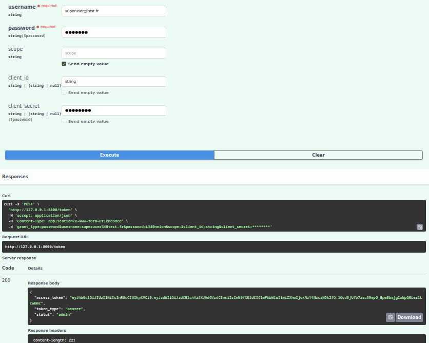

On voit sur cette image que si on se connecte avec le compte superuser l'api nous renvois bien un jwt.

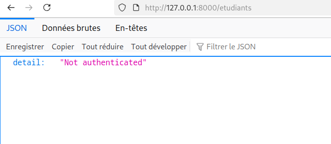

On voit sur cette image que si on tente d'accéder a http://localhost:8000/etudiants sans jeton alors on est rejeter car "Not authenticated".


2. Tests d'Intégration PHP (Frontend)

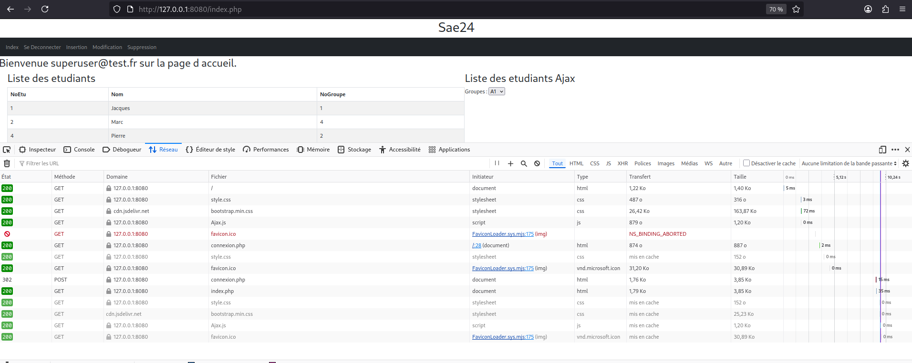

On peut voir qur la première ligne que l'authorization du compte qui tente de se connecter a fonctionner car le code de retour est 302 ce qui veut dire que le serveur l'a bien trouvé et la bien authentifié

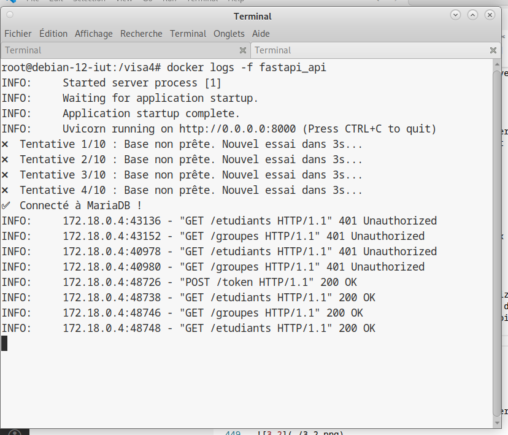

On distingue sur cette capture des logs de l'api qui un token est bien créer et garder cotés serveur.

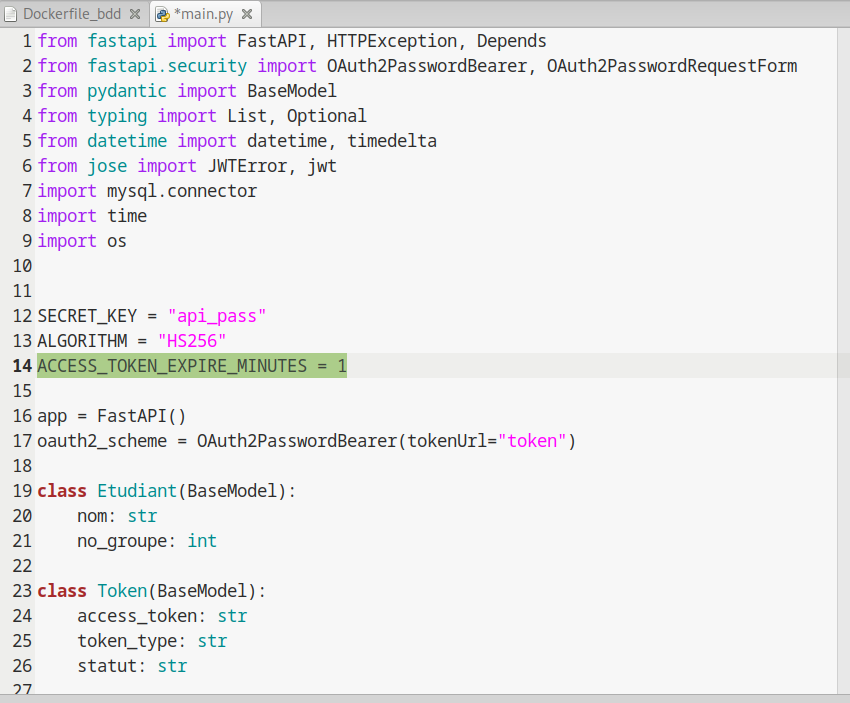

On voit que j'ai modifié la durée de validité du token a 1 minute

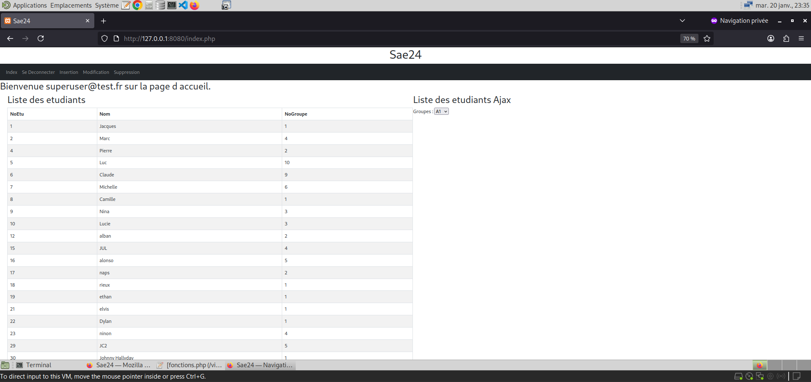

On voit que l'on se connecte a 23h35

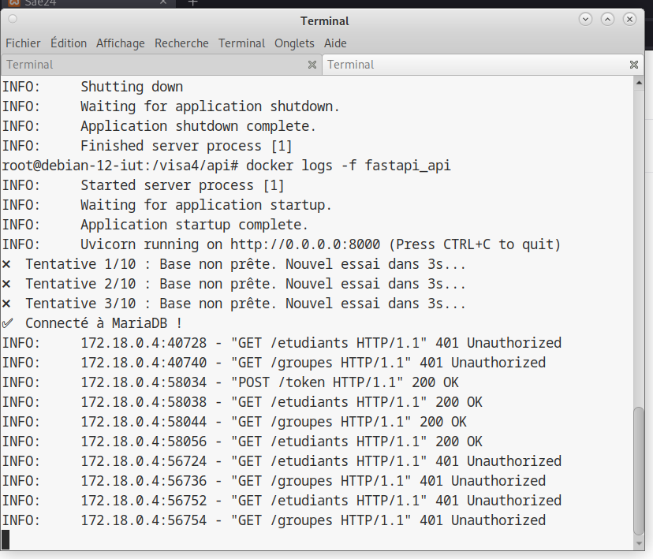

La connexion faite apparait bien dans les logs et on peut voit qu'ensuite il y a bien un retour a Unauthorized.

1. Tests des Opérations CRUD

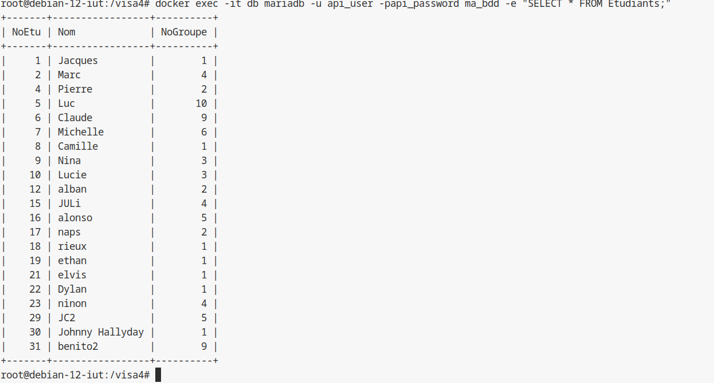

On peut voir sur cette image la bdd qui est héberger sur le container.

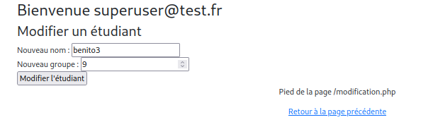

On voit la modification d'un étudiant via l'interface web

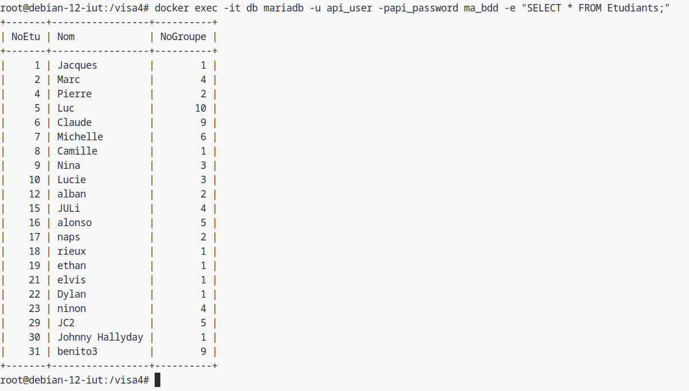

On peut voir qu'après la modification via l'interface web, l'ajour s'effectue bien sur la bdd héberger.


4. Tests de l'Infrastructure Docker

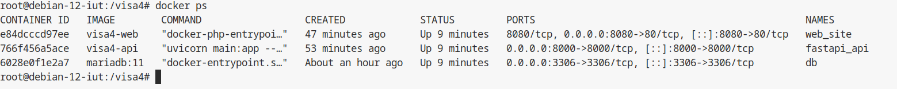

On peut voir qu'il y a bien 3 container actif en cour d'éxécution

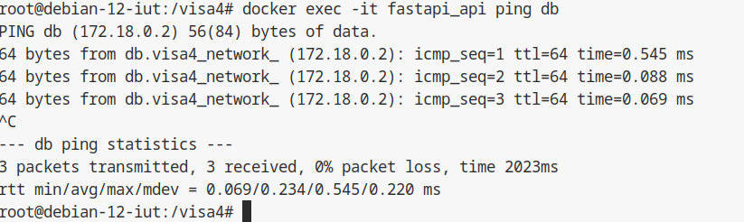

On peut voir que le container api peut communiquer avec le container hébergeant la bdd.

### Notice d'Installation
Prérequis
Docker Engine 20.10+

```bash
#se situer dans le dossier et lancer la commande suivante
docker compose up --build
```

## Conclusion
### Objectifs du VISA 3 Atteints
Authentification JWT : Validé (Token reçu et décodé)

Accès sécurisé API : Validé (401 sans token)

Interface PHP : Validé (Appels via callAPI fonctionnels)

Docker Compose : Validé (Déploiement en 1 commande)

### Préparation VISA 5
Le travail suivant (Version 5) consistera à utiliser l'approche P00 et le modèle MVC